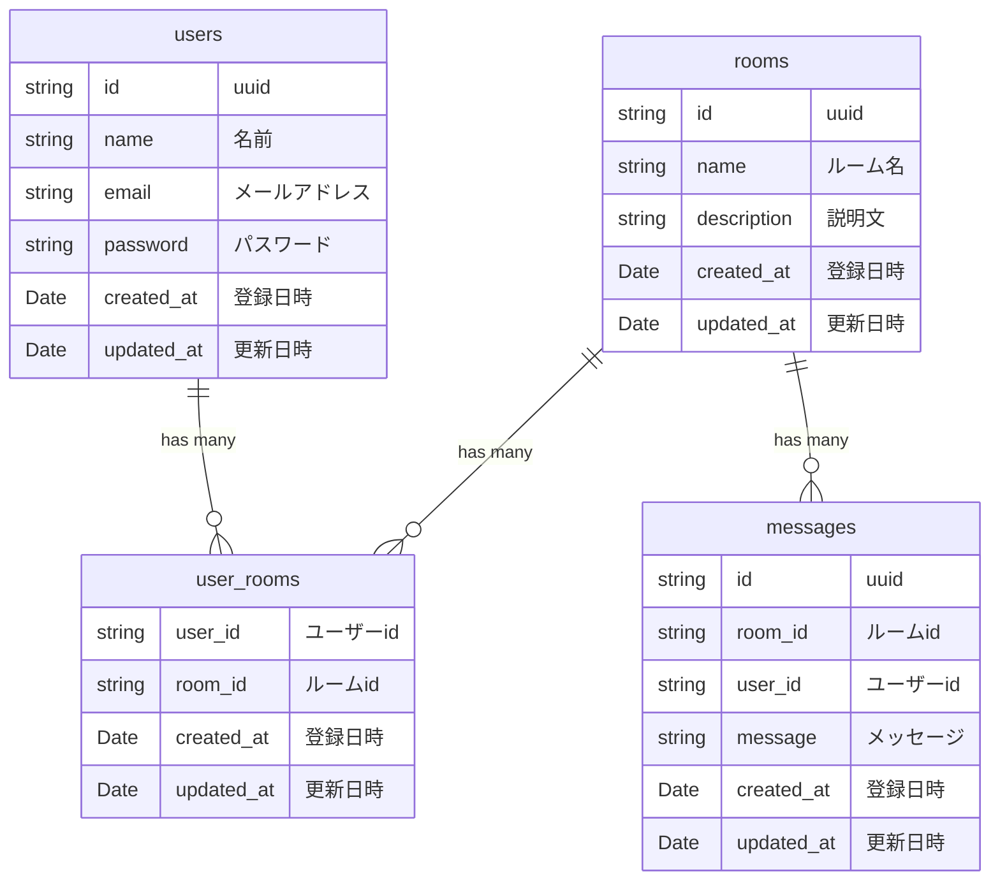

# Next.js を利用した chat アプリケーション開発

---

## ERD

最小限の要件を満たす ER 図

```mermaid
erDiagram
    users ||--o{ user_rooms : "has many"
    users {
        string id "uuid"
        string name "名前"
        string email "メールアドレス"
        string password "パスワード"
        Date created_at "登録日時"
        Date updated_at "更新日時"
    }

    user_rooms
    user_rooms {
        string user_id "ユーザーid"
        string room_id "ルームid"
        Date created_at "登録日時"
        Date updated_at "更新日時"
    }

    rooms ||--o{ user_rooms : "has many"
    rooms ||--o{ messages : "has many"
    rooms {
        string id "uuid"
        string name "ルーム名"
        string description "説明文"
        Date created_at "登録日時"
        Date updated_at "更新日時"
    }

    messages {
        string id "uuid"
        string room_id "ルームid"
        string user_id "ユーザーid"
        string message "メッセージ"
        Date created_at "登録日時"
        Date updated_at "更新日時"
    }

```
