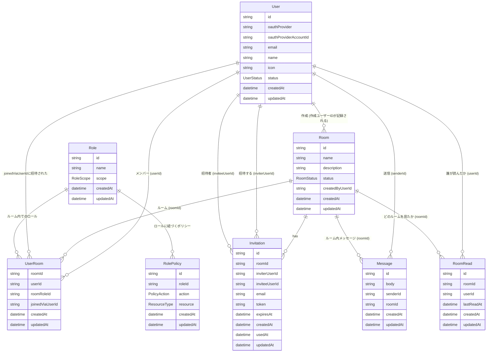
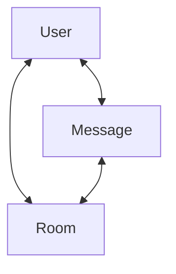
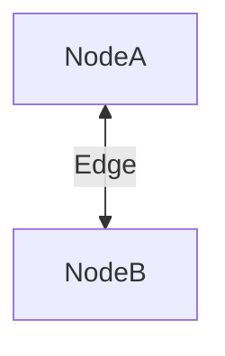

# Next.js を利用した chat アプリケーション開発

---

## ERD



## GraphQL

### グラフモデル



### ノードとエッジについて

図の関係にある



## GraphQL 設計一覧

```graphql
"""
========================
Connection 共通
========================
"""
type PageInfo {
  hasNextPage: Boolean!
  endCursor: String
}

"""
========================
Query
========================
"""
type Query {
  """
  ログイン中ユーザー情報
  """
  me: UserNode!

  """
  自分が参加しているルーム一覧（ページング）
  - first/after: 前方向ページング
  """
  myRooms(first: Int, after: String): RoomConnection!

  """
  ルーム詳細
  - messages/members/readState は RoomNode のフィールドで取得
  """
  room(id: ID!): RoomNode

  """
  メッセージ一覧
  """
  messages(
    searchOptions: MessageSearchOptions
    order: Order
  ): MessageConnection!

  """
  ユーザー一覧
  """
  users(searchOptions: UserSearchOptions, order: Order): UserConnection!
}

"""
========================
Mutation
========================
"""
type Mutation {
  """
  ユーザー作成
  """
  createUser(input: CreateUserInput!): CreateUserPayload!

  """
  ルーム作成（作成者はオーナーになる想定）
  """
  createRoom(input: CreateRoomInput!): CreateRoomPayload!

  """
  メッセージ送信
  """
  createMessage(input: CreateMessageInput!): CreateMessagePayload!

  """
  ルーム参加
  - invitationTokenあり：招待リンク経由（期限・使用済みなど検証）
  """
  joinRoom(input: JoinRoomInput!): JoinRoomPayload!

  """
  ルーム退室
  """
  leaveRoom(input: LeaveRoomInput!): LeaveRoomPayload!

  """
  既読更新（DBのlastReadAtに合わせる）
  """
  markRoomRead(input: MarkRoomReadInput!): MarkRoomReadPayload!

  """
  招待トークン発行
  - inviteeUserId / inviteeEmail は任意（両方nullは弾く等のバリデーション実施）
  """
  createInvitation(input: CreateInvitationInput!): CreateInvitationPayload!
}

"""
========================
Subscription
========================
"""
type Subscription {
  """
  メッセージ追加イベント
  """
  messageAdded(roomId: ID!): MessageNode!

  """
  ルーム参加イベント
  """
  roomMemberAdded(roomId: ID!): UserRoomNode!

  """
  既読更新イベント
  - 最低限 roomId / userId / lastReadAt を流す
  - unreadCount は Query で算出が安全
  """
  roomReadUpdated(roomId: ID!): RoomReadState!

  """
  ルーム作成イベント（任意：ルーム一覧をリアルタイム更新したい場合）
  """
  roomAdded: RoomNode!
}

"""
========================
Inputs
========================
"""
input CreateUserInput {
  email: String!
  name: String!
  icon: String
  oauthProvider: string!
  oauthProviderAccountId: string!
}

input CreateRoomInput {
  name: String!
  description: String
  status: RoomStatus!
}

input CreateMessageInput {
  roomId: ID!
  body: String!
}

input JoinRoomInput {
  roomId: ID!
  """
  招待リンク経由の場合のみ指定
  """
  invitationToken: String
}

input LeaveRoomInput {
  roomId: ID!
}

input MarkRoomReadInput {
  roomId: ID!
  """
  最終既読時刻（単調増加させる）
  """
  lastReadAt: DateTime!
}

input CreateInvitationInput {
  roomId: ID!
  inviteeUserId: ID
  inviteeEmail: String
  expiresAt: DateTime
}

input MessageSearchOption {
  roomId: ID
  userId: ID
  keyword: String
}

input UserSearchOption {
  roomId: ID
  userId: ID
  keyword: String
}

"""
========================
Payloads（Mutationの戻り値）
========================
"""
type CreateUserPayload {
  user: UserNode!
}

type CreateRoomPayload {
  room: RoomNode!
}

type CreateMessagePayload {
  message: MessageNode!
}

type JoinRoomPayload {
  membership: UserRoomNode!
  room: RoomNode!
}

type LeaveRoomPayload {
  roomId: ID!
  userId: ID!
}

type MarkRoomReadPayload {
  readState: RoomReadState!
}

type CreateInvitationPayload {
  invitation: InvitationNode!
  inviteLink: String!
}

"""
========================
Node types
========================
"""
type UserNode {
  id: ID!
  name: String!
  email: String!
  icon: String
  status: UserStatus!
  createdAt: DateTime!
}

type RoomNode {
  id: ID!
  name: String!
  description: String
  status: RoomStatus!
  createdByUserId: ID!
  createdAt: DateTime!

  """
  参加メンバー（ページング）
  """
  members(first: Int, after: String): UserRoomConnection!

  """
  メッセージ一覧（ページング）
  - 「新しい順/古い順」を選びたくなったら使う orderBy を用意
  """
  messages(
    first: Int
    after: String
    orderBy: MessageOrderBy = CREATED_AT_DESC
  ): MessageConnection!

  """
  自分の既読状態（非メンバーならnull）
  """
  readState: RoomReadState
}

type UserRoomNode {
  userId: ID!
  roomId: ID!

  """
  ルーム権限（Role.name をそのまま返す想定）
  例：ROOM_OWNER / ROOM_MEMBER / ROOM_READONLY
  """
  role: String!

  joinedAt: DateTime!
  joinedViaUserId: ID
}

type InvitationNode {
  id: ID!
  roomId: ID!
  inviterUserId: ID!
  inviteeUserId: ID
  email: String!
  token: String!
  expiresAt: DateTime
  usedAt: DateTime
  createdAt: DateTime!
}

type MessageNode {
  id: ID!
  roomId: ID!
  userId: ID!
  body: String!
  createdAt: DateTime!
}

type RoomReadState {
  roomId: ID!
  userId: ID!
  lastReadAt: DateTime
  """
  Query（myRooms/room）で算出するのが安全
  """
  unreadCount: Int
}

"""
========================
Connection 定義
========================
"""
type RoomEdge {
  cursor: String!
  node: RoomNode!
}

type UserEdge {
  cursor: String!
  node: RoomNode!
}

type MessageEdge {
  cursor: String!
  node: RoomNode!
}

type RoomConnection {
  edges: [RoomEdge!]!
  nodes: [RoomNode!]!
  pageInfo: PageInfo!
  totalCount: Int
}

type UserConnection {
  edges: [UserEdge]!
  nodes: [UserNode]!
  pageInfo: PageInfo!
  totalCount: Int
}

type MessageConnection {
  edges: [MessageEdge]!
  nodes: [MessageNode]!
  pageInfo: PageInfo!
  totalCount: Int
}

type UserRoomEdge {
  cursor: String!
  node: UserRoomNode!
}

type UserRoomConnection {
  edges: [UserRoomEdge!]!
  nodes: [UserRoomNode!]!
  pageInfo: PageInfo!
  totalCount: Int
}

type MessageEdge {
  cursor: String!
  node: MessageNode!
}

type MessageConnection {
  edges: [MessageEdge!]!
  nodes: [MessageNode!]!
  pageInfo: PageInfo!
  totalCount: Int
}

"""
========================
Enums
========================
"""
enum UserStatus {
  ACTIVE
  INACTIVE
}

enum RoomStatus {
  ACTIVE
  INACTIVE
}

enum OrderBy {
  CREATED_AT_DESC
  CREATED_AT_ASC
}
```
