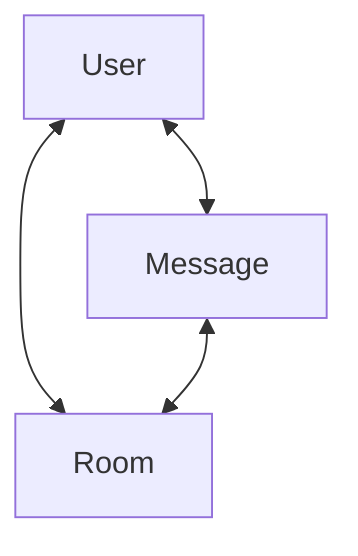
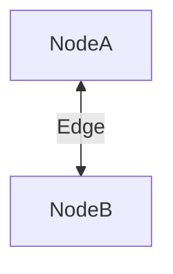

# Next.js を利用した chat アプリケーション開発

---

## ERD

最小限の要件を満たす ER 図

```mermaid
erDiagram
    users ||--o{ rooms : "作成する"
    users ||--o{ user_rooms : "参加する"
    users ||--o{ messages : "送信する"
    users ||--o{ room_reads : "既読状態を持つ"
    users ||--o{ invitations : "招待する(招待者)"

    rooms ||--o{ user_rooms : "参加者を持つ"
    rooms ||--o{ messages : "メッセージを持つ"
    rooms ||--o{ room_reads : "既読状態を持つ"
    rooms ||--o{ invitations : "招待を持つ"

    invitations ||--o{ user_rooms : "参加ログに紐づく(任意)"

    users {
        string id "ユーザーID(uuid)"
        string name "名前"
        string email "メールアドレス"
        string password "パスワード"
        datetime created_at "登録日時"
        datetime updated_at "更新日時"
        datetime deleted_at "削除日時(論理削除/任意)"
    }

    rooms {
        string id "ルームID(uuid)"
        string name "ルーム名"
        string description "説明文"
        string created_by_user_id "作成者ユーザーID"
        string join_policy "参加ポリシー(OPEN / INVITE_ONLY 等)"
        datetime created_at "登録日時"
        datetime updated_at "更新日時"
        datetime deleted_at "削除日時(論理削除/任意)"
    }

    user_rooms {
        string user_id "ユーザーID"
        string room_id "ルームID"
        string role "権限(OWNER / ADMIN / MEMBER)"
        datetime joined_at "参加日時"
        datetime left_at "退室日時(任意)"
        string joined_via_invitation_id "招待経由なら招待ID(任意)"
        datetime created_at "登録日時"
        datetime updated_at "更新日時"
    }

    messages {
        string id "メッセージID(uuid)"
        string room_id "ルームID"
        string user_id "送信ユーザーID"
        string message "メッセージ本文"
        datetime created_at "送信日時"
        datetime updated_at "更新日時"
        datetime deleted_at "削除日時(論理削除/任意)"
    }

    room_reads {
        string room_id "ルームID"
        string user_id "ユーザーID"
        string last_read_message_id "最終既読メッセージID(任意)"
        datetime last_read_at "最終既読日時(任意)"
        datetime created_at "登録日時"
        datetime updated_at "更新日時"
    }

    invitations {
        string id "招待ID(uuid)"
        string room_id "ルームID"
        string inviter_user_id "招待者ユーザーID"
        string invitee_user_id "招待されるユーザーID(任意)"
        string invitee_email "メール招待先(任意)"
        string token "招待トークン(URL用・一意)"
        datetime expires_at "有効期限(任意)"
        datetime used_at "招待トークンがjoinで使われた日時(任意)"
        datetime created_at "作成日時"
        datetime updated_at "更新日時"
    }
```

## GraphQL

#### グラフモデル

```mermaid
graph TD
  User
  Message
  Room

  User <--> Message
  User <--> Room
  Message <-->Room
```

#### ノードとエッジについて

図の関係にある

```mermaid
graph TD
  NodeA
  NodeB


  NodeA <--> |Edge|NodeB
```

#### Graphql設計

```mermaid
flowchart TB
  %% =====================
  %% GraphQL API 構成
  %% =====================

  subgraph Query["Query（取得）"]
    QMe["me(): UserNode!<br/>※ログインユーザー"]
    QMyRooms["myRooms(): [RoomNode!]!<br/>※参加ルーム一覧"]
    QRoom["room(id: ID!): RoomNode<br/>※room配下で messages / members / readState を取得"]
  end

  subgraph Mutation["Mutation（更新）"]
    MCreateUser["createUser(input: CreateUserInput!): CreateUserPayload!"]
    MCreateRoom["createRoom(input: CreateRoomInput!): CreateRoomPayload!"]
    MCreateMessage["createMessage(input: CreateMessageInput!): CreateMessagePayload!"]

    MJoinRoom["joinRoom(input: JoinRoomInput!): JoinRoomPayload!<br/>※invitationTokenは任意"]
    MLeaveRoom["leaveRoom(input: LeaveRoomInput!): LeaveRoomPayload!"]

    MMarkRead["markRoomRead(input: MarkRoomReadInput!): MarkRoomReadPayload!<br/>※最終既読を更新"]
    MCreateInvitation["createInvitation(input: CreateInvitationInput!): CreateInvitationPayload!<br/>※リンク用token発行"]
  end

  subgraph Subscription["Subscription（通知）"]
    SMessageAdded["messageAdded(roomId: ID!): MessageNode!"]
    SMemberAdded["roomMemberAdded(roomId: ID!): UserRoomNode!<br/>※参加イベント"]
    SReadUpdated["roomReadUpdated(roomId: ID!): RoomReadState!<br/>※既読更新イベント"]
    SRoomAdded["roomAdded(): RoomNode!"]
  end

  %% =====================
  %% 型（概念）
  %% =====================
  subgraph Types["主な型（概念）"]
    TUser["UserNode"]
    TRoom["RoomNode"]
    TMembership["UserRoomNode<br/>（= user_rooms）"]
    TMessage["MessageNode"]
    TRead["RoomReadState<br/>（= room_reads）"]
    TInvite["InvitationNode<br/>（= invitations）"]
  end

  %% =====================
  %% 入力（主要）
  %% =====================
  subgraph Inputs["主要Input（例）"]
    IJoin["JoinRoomInput{ roomId, invitationToken? }"]
    IMark["MarkRoomReadInput{ roomId, lastReadMessageId }"]
    IInv["CreateInvitationInput{ roomId, inviteeUserId? , inviteeEmail? , expiresAt? }"]
  end

  %% 関係（ざっくり）
  MJoinRoom --> TMembership
  MJoinRoom --> TRoom
  MCreateMessage --> TMessage
  MMarkRead --> TRead
  MCreateInvitation --> TInvite

  QMe --> TUser
  QMyRooms --> TRoom
  QRoom --> TRoom

  SMessageAdded --> TMessage
  SMemberAdded --> TMembership
  SReadUpdated --> TRead
  SRoomAdded --> TRoom

  IJoin --> MJoinRoom
  IMark --> MMarkRead
  IInv --> MCreateInvitation
```
