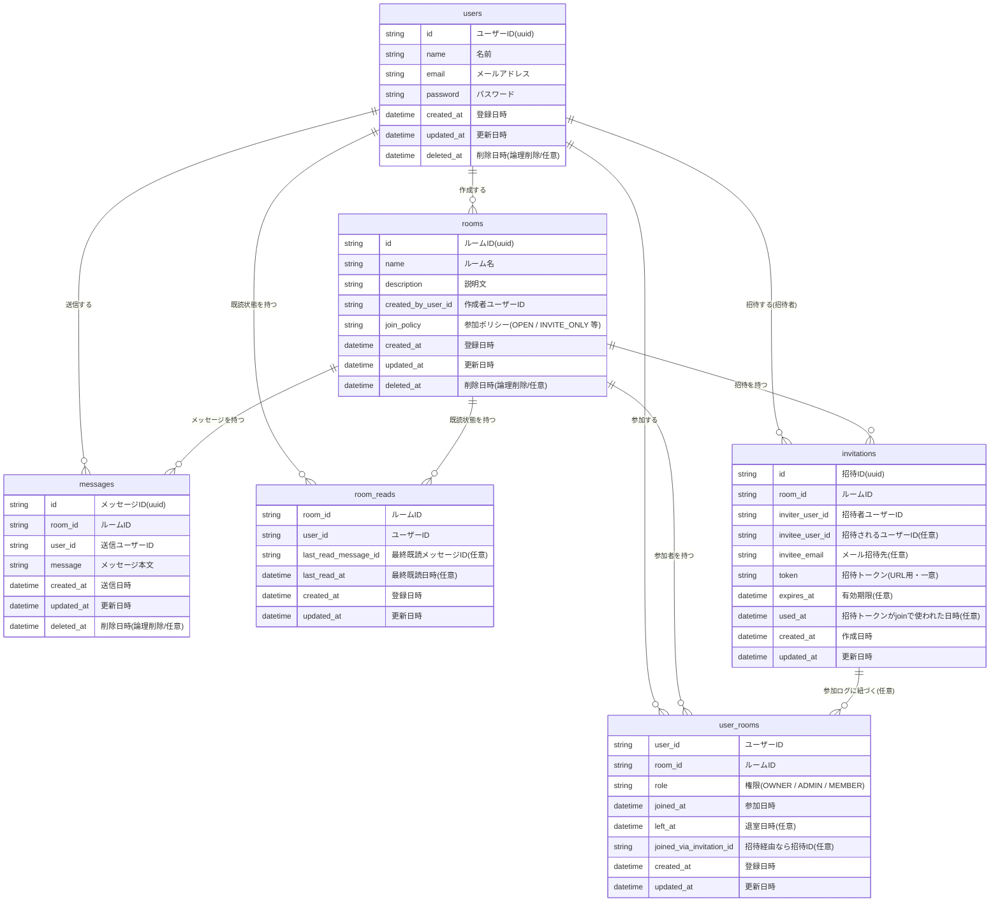
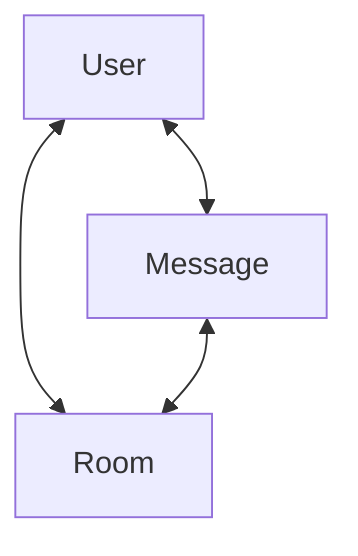
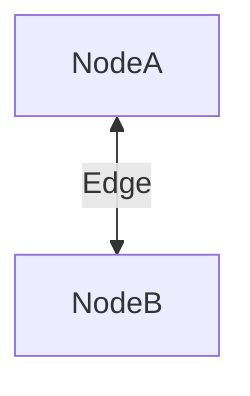

# Next.js を利用した chat アプリケーション開発

---

## ERD

最小限の要件を満たす ER 図

## GraphQL

### グラフモデル

### ノードとエッジについて

図の関係にある

## GraphQL 設計一覧

---

### Query

| 名前    | 引数    | 戻り値       | 説明                                                |
| ------- | ------- | ------------ | --------------------------------------------------- |
| me      | なし    | UserNode!    | ログインユーザー情報取得                            |
| myRooms | なし    | [RoomNode!]! | 自分が参加しているルーム一覧                        |
| room    | id: ID! | RoomNode     | ルーム詳細（messages / members / readState を含む） |

---

### Mutation

#### ユーザー・ルーム

| 名前          | Input               | 戻り値                | 説明           |
| ------------- | ------------------- | --------------------- | -------------- |
| createUser    | CreateUserInput!    | CreateUserPayload!    | ユーザー登録   |
| createRoom    | CreateRoomInput!    | CreateRoomPayload!    | ルーム作成     |
| createMessage | CreateMessageInput! | CreateMessagePayload! | メッセージ送信 |

---

#### ルーム参加・退室

| 名前      | Input           | 戻り値            | 説明                           |
| --------- | --------------- | ----------------- | ------------------------------ |
| joinRoom  | JoinRoomInput!  | JoinRoomPayload!  | ルーム参加（招待トークン任意） |
| leaveRoom | LeaveRoomInput! | LeaveRoomPayload! | ルーム退室                     |

---

#### 既読管理

| 名前         | Input              | 戻り値               | 説明                   |
| ------------ | ------------------ | -------------------- | ---------------------- |
| markRoomRead | MarkRoomReadInput! | MarkRoomReadPayload! | 最終既読メッセージ更新 |

---

#### 招待

| 名前             | Input                  | 戻り値                   | 説明                     |
| ---------------- | ---------------------- | ------------------------ | ------------------------ |
| createInvitation | CreateInvitationInput! | CreateInvitationPayload! | 招待リンク用トークン発行 |

---

### Subscription

| 名前            | 引数        | 戻り値         | 説明           |
| --------------- | ----------- | -------------- | -------------- |
| messageAdded    | roomId: ID! | MessageNode!   | メッセージ通知 |
| roomMemberAdded | roomId: ID! | UserRoomNode!  | ルーム参加通知 |
| roomReadUpdated | roomId: ID! | RoomReadState! | 既読更新通知   |
| roomAdded       | なし        | RoomNode!      | ルーム作成通知 |

---

### Input 定義

---

#### JoinRoomInput

| フィールド      | 型     | 必須 | 説明                     |
| --------------- | ------ | ---- | ------------------------ |
| roomId          | ID     | ○    | 参加対象ルーム           |
| invitationToken | String | ×    | 招待リンク経由の場合のみ |

---

#### LeaveRoomInput

| フィールド | 型  | 必須 | 説明           |
| ---------- | --- | ---- | -------------- |
| roomId     | ID  | ○    | 退室対象ルーム |

---

#### MarkRoomReadInput

| フィールド        | 型  | 必須 | 説明               |
| ----------------- | --- | ---- | ------------------ |
| roomId            | ID  | ○    | 対象ルーム         |
| lastReadMessageId | ID  | ○    | 最終既読メッセージ |

---

#### CreateInvitationInput

| フィールド    | 型       | 必須 | 説明           |
| ------------- | -------- | ---- | -------------- |
| roomId        | ID       | ○    | 招待対象ルーム |
| inviteeUserId | ID       | ×    | 招待ユーザー   |
| inviteeEmail  | String   | ×    | メール招待     |
| expiresAt     | DateTime | ×    | 有効期限       |

---

### Payload 定義

---

#### JoinRoomPayload

| フィールド | 型            | 説明           |
| ---------- | ------------- | -------------- |
| membership | UserRoomNode! | 参加情報       |
| room       | RoomNode!     | 参加したルーム |

---

#### CreateRoomPayload

| フィールド | 型        | 説明             |
| ---------- | --------- | ---------------- |
| room       | RoomNode! | 作成されたルーム |

---

#### CreateMessagePayload

| フィールド | 型           | 説明                 |
| ---------- | ------------ | -------------------- |
| message    | MessageNode! | 作成されたメッセージ |

---

#### MarkRoomReadPayload

| フィールド | 型             | 説明             |
| ---------- | -------------- | ---------------- |
| readState  | RoomReadState! | 更新後の既読状態 |

---

#### CreateInvitationPayload

| フィールド | 型              | 説明              |
| ---------- | --------------- | ----------------- |
| invitation | InvitationNode! | 招待情報          |
| inviteLink | String!         | フロント表示用URL |

---

### Node 型

---

#### UserNode

| フィールド | 型      | 説明           |
| ---------- | ------- | -------------- |
| id         | ID!     | ユーザーID     |
| name       | String! | 名前           |
| email      | String! | メールアドレス |

---

#### RoomNode

| フィールド  | 型               | 説明           |
| ----------- | ---------------- | -------------- |
| id          | ID!              | ルームID       |
| name        | String!          | ルーム名       |
| description | String           | 説明           |
| joinPolicy  | RoomJoinPolicy!  | 参加方式       |
| members     | [UserRoomNode!]! | 参加メンバー   |
| messages    | [MessageNode!]!  | メッセージ一覧 |
| readState   | RoomReadState    | 自分の既読状態 |

---

#### UserRoomNode（参加情報）

| フィールド          | 型             | 説明           |
| ------------------- | -------------- | -------------- |
| userId              | ID!            | ユーザー       |
| roomId              | ID!            | ルーム         |
| role                | RoomRole!      | 権限           |
| joinedAt            | DateTime!      | 参加日時       |
| joinedViaInvitation | InvitationNode | 招待経由の場合 |

---

#### InvitationNode

| フィールド | 型       | 説明         |
| ---------- | -------- | ------------ |
| id         | ID!      | 招待ID       |
| roomId     | ID!      | ルーム       |
| token      | String!  | 招待トークン |
| expiresAt  | DateTime | 有効期限     |
| usedAt     | DateTime | 使用日時     |

---

#### MessageNode

| フィールド | 型        | 説明         |
| ---------- | --------- | ------------ |
| id         | ID!       | メッセージID |
| roomId     | ID!       | ルーム       |
| userId     | ID!       | 送信者       |
| message    | String!   | 本文         |
| createdAt  | DateTime! | 送信日時     |

---

#### RoomReadState

| フィールド        | 型       | 説明     |
| ----------------- | -------- | -------- |
| roomId            | ID!      | ルーム   |
| lastReadMessageId | ID       | 最終既読 |
| lastReadAt        | DateTime | 既読日時 |
| unreadCount       | Int!     | 未読数   |

---

### Enum

---

#### RoomJoinPolicy

| 値          | 説明                 |
| ----------- | -------------------- |
| OPEN        | 誰でも参加可能       |
| INVITE_ONLY | 招待必須（将来拡張） |

---

#### RoomRole

| 値     | 説明       |
| ------ | ---------- |
| OWNER  | オーナー   |
| ADMIN  | 管理者     |
| MEMBER | 一般参加者 |

### 関連図

```mermaid
flowchart TB
  %% =====================
  %% GraphQL API 構成
  %% =====================

  subgraph Query["Query（取得）"]
    QMe["me(): UserNode!<br/>※ログインユーザー"]
    QMyRooms["myRooms(): [RoomNode!]!<br/>※参加ルーム一覧"]
    QRoom["room(id: ID!): RoomNode<br/>※room配下で messages / members / readState を取得"]
  end

  subgraph Mutation["Mutation（更新）"]
    MCreateUser["createUser(input: CreateUserInput!): CreateUserPayload!"]
    MCreateRoom["createRoom(input: CreateRoomInput!): CreateRoomPayload!"]
    MCreateMessage["createMessage(input: CreateMessageInput!): CreateMessagePayload!"]

    MJoinRoom["joinRoom(input: JoinRoomInput!): JoinRoomPayload!<br/>※invitationTokenは任意"]
    MLeaveRoom["leaveRoom(input: LeaveRoomInput!): LeaveRoomPayload!"]

    MMarkRead["markRoomRead(input: MarkRoomReadInput!): MarkRoomReadPayload!<br/>※最終既読を更新"]
    MCreateInvitation["createInvitation(input: CreateInvitationInput!): CreateInvitationPayload!<br/>※リンク用token発行"]
  end

  subgraph Subscription["Subscription（通知）"]
    SMessageAdded["messageAdded(roomId: ID!): MessageNode!"]
    SMemberAdded["roomMemberAdded(roomId: ID!): UserRoomNode!<br/>※参加イベント"]
    SReadUpdated["roomReadUpdated(roomId: ID!): RoomReadState!<br/>※既読更新イベント"]
    SRoomAdded["roomAdded(): RoomNode!"]
  end

  %% =====================
  %% 型（概念）
  %% =====================
  subgraph Types["主な型（概念）"]
    TUser["UserNode"]
    TRoom["RoomNode"]
    TMembership["UserRoomNode<br/>（= user_rooms）"]
    TMessage["MessageNode"]
    TRead["RoomReadState<br/>（= room_reads）"]
    TInvite["InvitationNode<br/>（= invitations）"]
  end

  %% =====================
  %% 入力（主要）
  %% =====================
  subgraph Inputs["主要Input（例）"]
    IJoin["JoinRoomInput{ roomId, invitationToken? }"]
    IMark["MarkRoomReadInput{ roomId, lastReadMessageId }"]
    IInv["CreateInvitationInput{ roomId, inviteeUserId? , inviteeEmail? , expiresAt? }"]
  end

  %% 関係（ざっくり）
  MJoinRoom --> TMembership
  MJoinRoom --> TRoom
  MCreateMessage --> TMessage
  MMarkRead --> TRead
  MCreateInvitation --> TInvite

  QMe --> TUser
  QMyRooms --> TRoom
  QRoom --> TRoom

  SMessageAdded --> TMessage
  SMemberAdded --> TMembership
  SReadUpdated --> TRead
  SRoomAdded --> TRoom

  IJoin --> MJoinRoom
  IMark --> MMarkRead
  IInv --> MCreateInvitation
```

