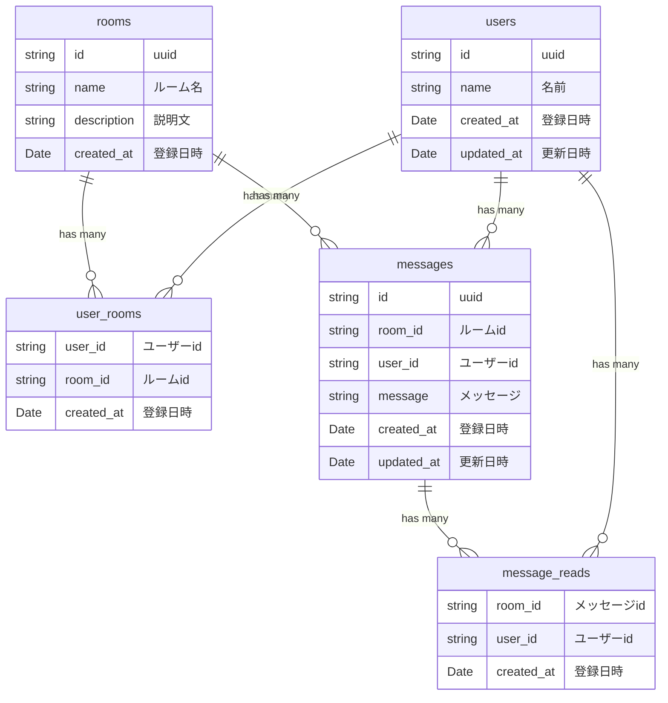

# Next.js を利用した chat アプリケーション開発

---

## ERD

最小限の要件を満たす ER 図



## GraphQL

#### 型情報

```graphql
type CreateUserInput {
  name: String!
}

type User {
  id: String!
  name: String!
}

type createMessageInput {
  body: String!
  senderId: String!
}

type Message {
  id: String!
  body: String!
  sender: User!
  readUsers: [User]!
}

type SearchOption {
  offset: Int!
  limit: Int!
}

type MessageRead {
  userId: String!
  messageId: String!
  readAt: Date!
}

type CreateMessageRead {
  userId: String!
  messageId: String!
  readAt: Date!
}
```

### ミューテーション

#### ユーザー登録

```graphql
mutation createUser(createUserInput: CreateUserInput!): User!
```

#### 既読情報登録

```graphql
mutation createMessageRead(createMessageReadInput: CreateMessageReadInput!): MessageRead!
```

#### メッセージ登録

```graphql
mutation createMessage(createMessageInput: CreateMessageInput): Message!
```

### クエリ

#### メッセージ取得

```graphql
query messages(searchOption: SearchOption!): [Message]!
```

### サブスクリプション

#### メッセージ取得

```graphql
subscription messageAdded(roomId: String!): Message!
```

#### 既読情報取得

```graphql
subscription messageRead(roomId: String!): MessageRead!
```
