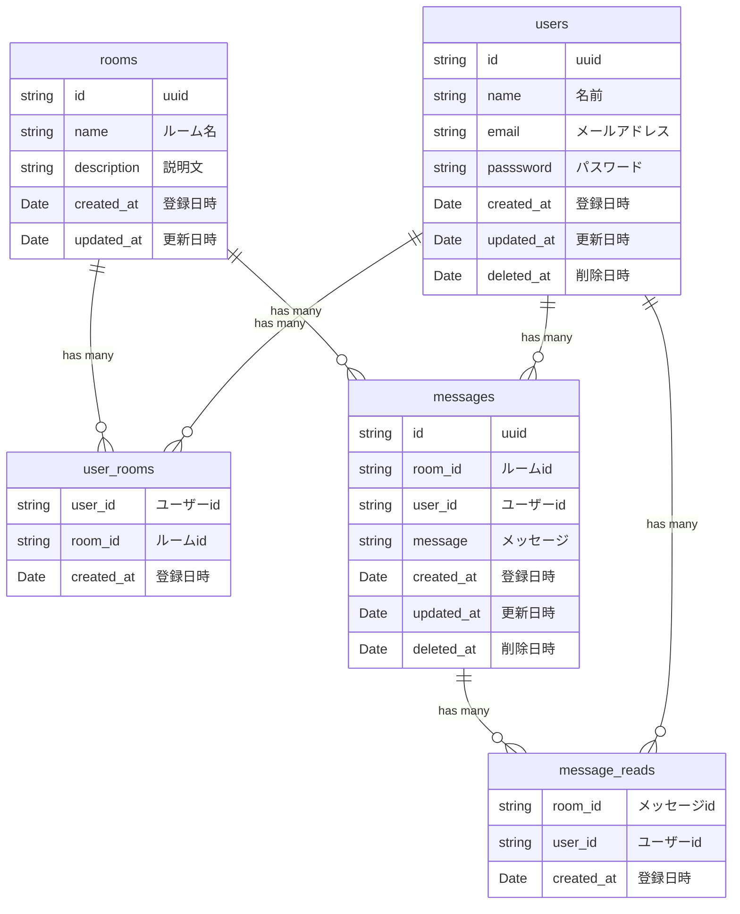
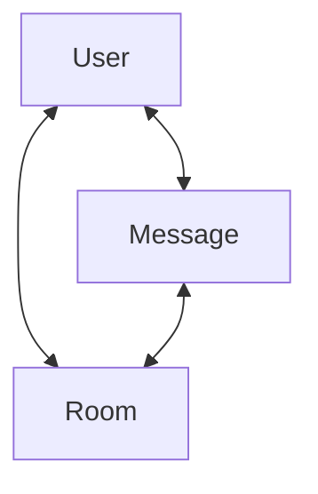
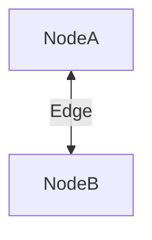

# Next.js を利用した chat アプリケーション開発

---

## ERD

最小限の要件を満たす ER 図



## GraphQL

#### グラフモデル



#### ノードとエッジについて

図の関係にある



#### 型情報

```graphql
# input
input CreateUserInput {
  name: String!
}

input CreateMessageReadInput {
  userId: String!
  messageId: String!
  readAt: Date!
}

input CreateMessageInput {
  body: String!
  senderId: String!
}

input CreateRoomInput {
  name: String!
  description: String!
}

input JoinUserToRoomInput {
  roomId: String!
  userId: String!
}

input SearchMessageOptionInput {
  roomId: ID
  userId: ID
  offset: Int!
  limit: Int!
}

input SearchRoomOptionInput {
  roomId: ID
  userId: ID
  offset: Int!
  limit: Int!
}

# object
type UserNode {
  id: ID!
  name: String!
  messages(searchMessageOption: SearchMessageOptionInput!): [Message!]!
  rooms(searchRoomOption: SearchRoomOptionInput!): [Room!]!
  createdAt: Date!
  updatedAt: Date!
}

type MessageNode {
  id: ID!
  body: String!
  readUsers: [User]!
  sender: User!
  room: Room!
  createdAt: Date!
  updatedAt: Date!
}

type RoomNode {
  id: ID!
  name: String!
  description: String!
  users: [User]!
  message: [Message]!
  createdAt: Date!
  updatedAt: Date!
}

type UserRoomEdge {
  userId: ID!
  roomId: ID!
  joinedAt: Date!
}

type MessageReadEdge {
  userId: String!
  messageId: String!
  readAt: Date!
}
```

### ミューテーション

#### ユーザー登録

```graphql
mutation createUser(createUserInput: CreateUserInput!): User!
```

#### 既読情報登録

```graphql
mutation createMessageRead(createMessageReadInput: CreateMessageReadInput!): MessageRead!
```

#### メッセージ登録

```graphql
mutation createMessage(createMessageInput: CreateMessageInput): Message!
```

#### ルーム登録

```graphql
mutation createRoom(createRoomInput: CreateRoomInput!)
```

#### ユーザーとルームの紐づけ登録

```graphql
mutation joinUserToRoom(joinUserToRoomInput: JoinUserToRoomInput!): UserRoomEdge!
```

### クエリ

#### メッセージ取得

```graphql
query messages(searchMessageOption: SearchMessageOptionInput!): [Message]!
```

#### ログインユーザー情報取得

```graphql
query me(): UserNode!
```

#### ユーザーが参加しているチャットルーム一覧取得

```graphql
query roomJoined(userId: ID!): [Room]!
```

#### ユーザーが参加していないチャットルーム一覧の取得

```graphql
query roomNotJoined(userId: ID!): [Room]!
```

### サブスクリプション

#### ユーザー作成通知

#### メッセージ通知

```graphql
subscription messageAdded(roomId: String!): Message!
```

#### 既読通知

```graphql
subscription messageRead(roomId: String!): MessageRead!
```

#### ルーム作成通知

```graphql
subscription roomAdded(): RoomNode!
```

#### ルーム参加通知

```graphql
subscription userJoinedRoom(roomId: String!): UserNode!
```
